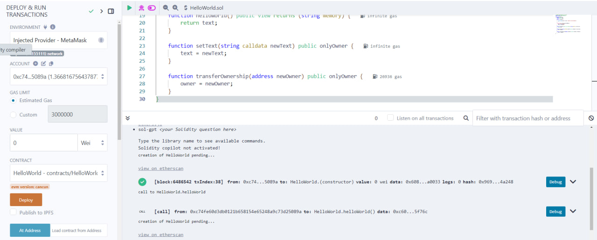
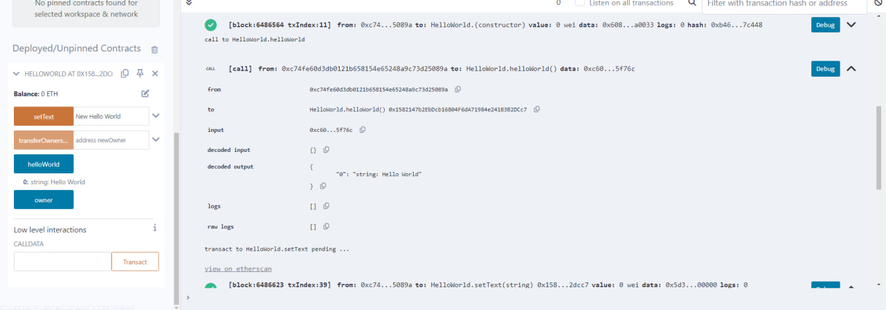
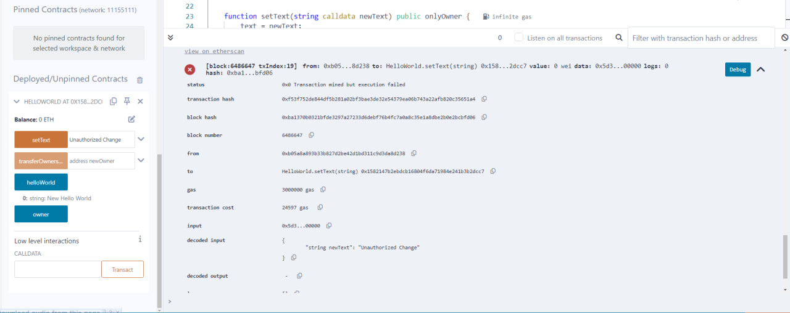
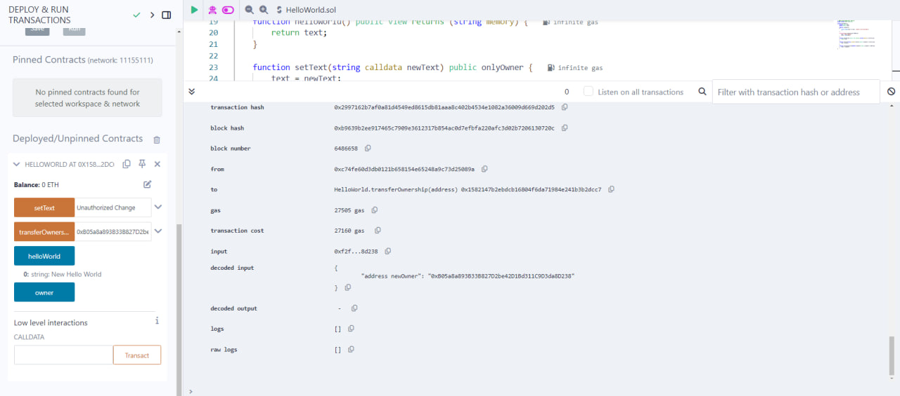
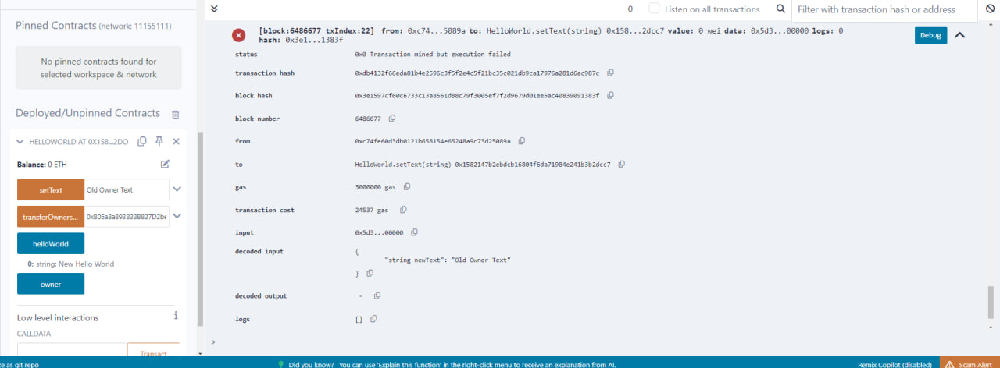

# Interaction Report for `HelloWorld.sol` on Sepolia Testnet

## Deployment Information:
- **Network**: Ethereum Sepolia Testnet
- **Contract Address**: [0x1582147b2EbDcb16804F6dA71984e241B3B2DCc7](https://sepolia.etherscan.io/address/0x1582147b2EbDcb16804F6dA71984e241B3B2DCc7)
- **Owner Address**: [0xC74Fe60d3db0121b658154E65248A9c73D25089A](https://sepolia.etherscan.io/address/0xC74Fe60d3db0121b658154E65248A9c73D25089A)
- **Transaction Hash**: [0xdfb045462e8724994717f44e850e218159cd03eb6a9b01a6c0bc5dae3f87e4ef](https://sepolia.etherscan.io/tx/0xdfb045462e8724994717f44e850e218159cd03eb6a9b01a6c0bc5dae3f87e4ef)

## Function Interactions:

1. **View Default Message (`helloWorld`)**
   - **Function Call**: `helloWorld()`
   - **Returned Value**: `"Hello World"`
   - **Execution Result**: Successful
  
   

2. **Change Message (`setText`)**
   - **Function Call**: `setText("New Hello World")`
   - **Caller Address**: [0xC74Fe60d3db0121b658154E65248A9c73D25089A](https://sepolia.etherscan.io/address/0xC74Fe60d3db0121b658154E65248A9c73D25089A)
   - **Transaction Hash**: [0x3baffaab44cec80d58baec3bad88946f84a71836fd02dd8d0eceb6a111fd29fd](https://sepolia.etherscan.io/tx/0x3baffaab44cec80d58baec3bad88946f84a71836fd02dd8d0eceb6a111fd29fd) 
   - **Execution Outcome**: Successful

   

3. **Attempt to Change Message by Non-Owner**
   - **Function Call**: `setText("Unauthorized Change")`
   - **Caller Address**: `0xB05a8a893B33B827D2be42D1Bd311C9D3da8D238`
   - **Transaction Hash**: [0xf53f752de844df5b281a02bf3bae3de32e54379ea06b743a22afb820c35651a4](https://sepolia.etherscan.io/tx/0xf53f752de844df5b281a02bf3bae3de32e54379ea06b743a22afb820c35651a4) 
   - **Execution Outcome**: Failed
   - **Revert Reason**: "Caller is not the owner"

   

4. **Transfer Ownership (`transferOwnership`)**
   - **Function Call**: `transferOwnership("0xNewOwnerAddress")`
   - **Caller Address**: [0xC74Fe60d3db0121b658154E65248A9c73D25089A](https://sepolia.etherscan.io/address/0xC74Fe60d3db0121b658154E65248A9c73D25089A)
   - **New Owner Address**: `0xB05a8a893B33B827D2be42D1Bd311C9D3da8D238` 
   - **Transaction Hash**: `[0x2997162b7af0a81d4549ed8615db81aaa8c402b4534e1082a36009d669d202d5](https://sepolia.etherscan.io/tx/0x2997162b7af0a81d4549ed8615db81aaa8c402b4534e1082a36009d669d202d5)
   - **Execution Result**: Successful
 

   

5. **Attempt to Change Message by Previous Owner**
   - **Function Call**: `setText("Old Owner Text")`
   - **Caller Address**: [0xC74Fe60d3db0121b658154E65248A9c73D25089A](https://sepolia.etherscan.io/address/0xC74Fe60d3db0121b658154E65248A9c73D25089A)
   - **Transaction Hash**: [0xdb4132f66eda81b4e2596c3f5f2e4c5f21bc35c021db9ca17976a281d6ac987c](https://sepolia.etherscan.io/tx/0xdb4132f66eda81b4e2596c3f5f2e4c5f21bc35c021db9ca17976a281d6ac987c)
   - **Execution Result**: Failed
   - **Revert Reason**: "Caller is not the owner"

   

