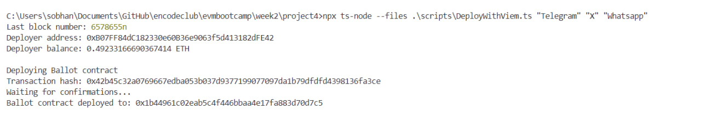
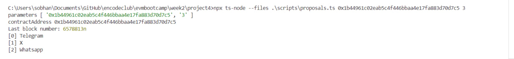
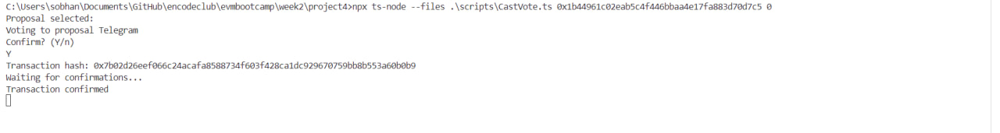
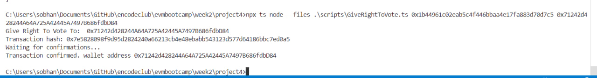
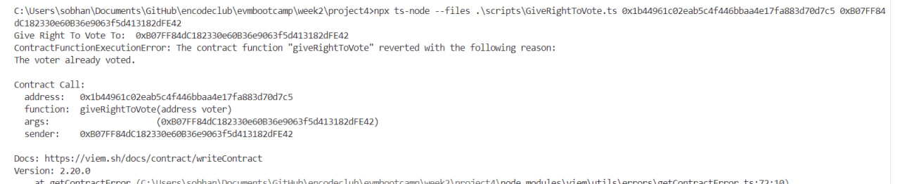

# Ballot Contract Interaction Report

- **Network**: [Sepolia](https://sepolia.etherscan.io/)
- **Ballot Contract**: `0x1b44961c02eab5c4f446bbaa4e17fa883d70d7c5`
- **Deployer Address**: `0xB07FF84dC182330e60B36e9063f5d413182dFE42`

---

## Deployment Details

The contract was deployed using the following command:

```bash
npx ts-node --files ./scripts/DeployWithViem.ts "Telegram" "X" "Whatsapp"
```
- Transaction Hash: 0x42b45c32a0769667edba053b037d9377199077097da1b79dfdfd4398136fa3ce




## List of Proposals

```bash
npx ts-node --files ./scripts/proposals.ts 0x1b44961c02eab5c4f446bbaa4e17fa883d70d7c5 3
```

## CastVote

```bash 
npx ts-node --files .\scripts\CastVote.ts 0x1b44961c02eab5c4f446bbaa4e17fa883d70d7c5 0
```
- Transaction Hash: 0x7b02d26eef066c24acafa8588734f603f428ca1dc929670759bb8b553a60b0b9

## Giving Voting Rights

**Successful Execution**
Voting rights were successfully granted to the address **0x71242d428244A64A725A42445A7497B686fdbD84** using the following command:
```bash
npx ts-node --files .\scripts\GiveRightToVote.ts 0x1b44961c02eab5c4f446bbaa4e17fa883d70d7c5 0x71242d428244A64A725A42445A7497B686fdbD84
```



**Failed Execution**
An attempt to give voting rights to the address **0xB07FF84dC182330e60B36e9063f5d413182dFE42** failed due to the following reason:
```bash
npx ts-node --files .\scripts\GiveRightToVote.ts 0x1b44961c02eab5c4f446bbaa4e17fa883d70d7c5 0xB07FF84dC182330e60B36e9063f5d413182dFE42
```
- Reason : "The voter already voted"


  